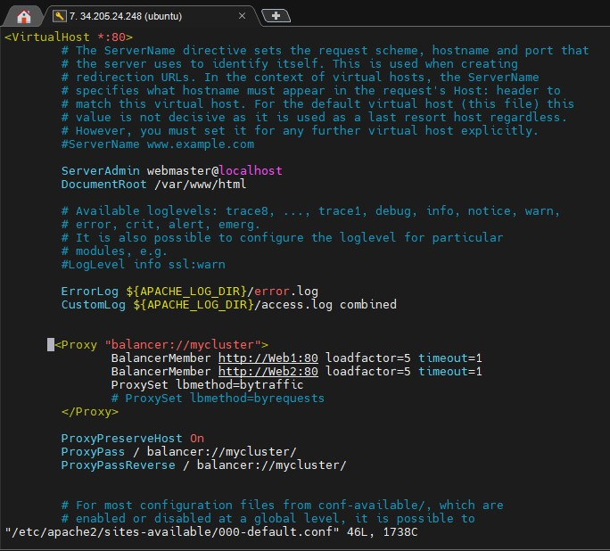

## CONFIGURING APACHE AS A LOAD BALANCER

### CONTINUATION OF PROJECT 7

### STEP 1 - INSTALL APACHE2

---

### STEP 2 - CONFIGURE LOAD BALANCING

---

### STEP 3 - LOAD BALANCER PUBLIC-IP ON BROWSER

---

### STEP 4 - ACCESS LOG

---

---

### STEP 5 - CONFIGURE LOCAL DNS NAMES RESOLUTION

---

### STEP 6 - UPDATE LOAD BALANCER CONFIGURATION FILE

---

### STEP 7 - LOAD BALANCER ON TERMINAL

---

---

---

---

---

